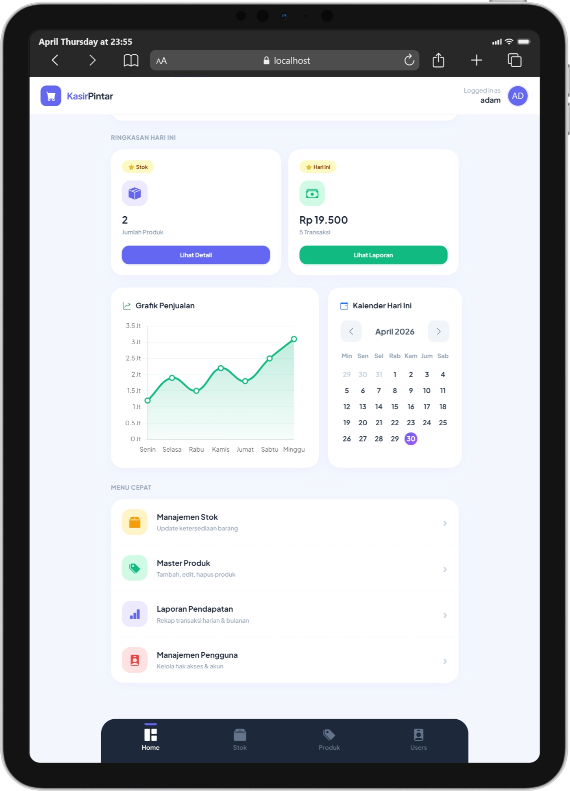
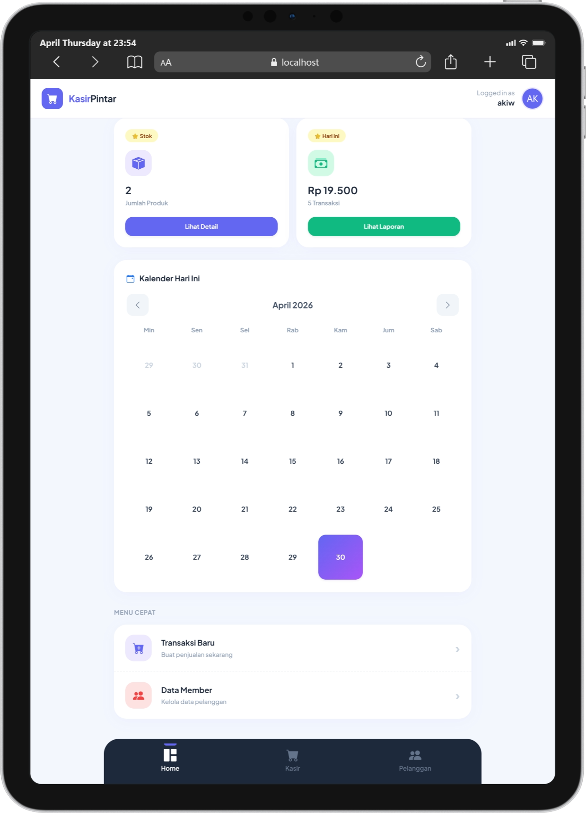

# 🛒 Kasir Pintar (Sistem Kasir Minimalis)

Aplikasi Kasir Minimalis modern berbasis web yang dirancang dengan antarmuka premium bergaya *Glassmorphism*. Dioptimalkan sepenuhnya untuk perangkat *mobile* (Mobile-First) untuk memastikan pengalaman operasional kasir dan manajemen toko yang mulus, cepat, dan intuitif.

---

## ✨ Fitur Unggulan

*   📱 **Mobile-First UI:** Desain antarmuka responsif tingkat tinggi. Susunan tata letak menyesuaikan dengan sempurna mulai dari layar *smartphone* kasir hingga monitor PC manajer.
*   ⚡ **Akselerasi Super Cepat:** Dibangun menggunakan **PHP Native murni**. Tanpa penumpukan modul berat dari *framework* raksasa, menghasilkan waktu muat (*loading time*) secepat kilat dan minim pemakaian RAM *server*.
*   🛡️ **Keamanan Anti-Injeksi:** Transaksi database sepenuhnya menggunakan eksekusi PDO (*Prepared Statements*) yang 100% kebal terhadap serangan *SQL Injection*.
*   📊 **Dashboard Eksekutif:** Dilengkapi *widget* kalender interaktif dan grafik pendapatan visual (*Chart.js*) untuk memantau arus kas secara *real-time*.
*   👥 **Multi-Role Cerdas:** Pemisahan hak akses dinamis dan tampilan menu berbeda antara Administrator (Fokus ke Laporan & Stok) dan Petugas/Kasir (Fokus ke Transaksi).

---

## 🛠️ Stack Teknologi

*   **Backend Server:** PHP 8.x (Native)
*   **Database:** MySQL / MariaDB (Driver PDO)
*   **Frontend UI:** HTML5, CSS3 (Custom Glassmorphism), Vanilla JavaScript
*   **Library Pendukung:** Chart.js (Grafik visual), SweetAlert2 (Notifikasi interaktif)
*   **Infrastruktur:** Sangat cocok untuk *deployment* menggunakan Container (Docker / Docker Compose).

---

## 📸 Cuplikan Layar Antarmuka

### 1. Dashboard (Tampilan Utama)

*Pusat kendali aplikasi dengan statistik ringkas, kalender, dan grafik penjualan.*

### 2. Antarmuka Manajemen Member

*Tampilan petugas bergaya Card-List dengan generator Avatar otomatis berdasarkan nama.*
